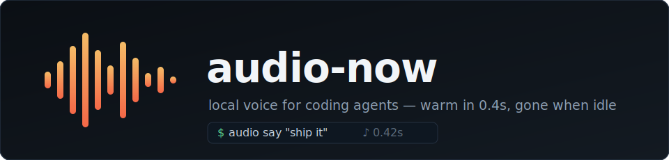

# audio-now




Local text-to-speech for coding agents on Apple Silicon. One command: `audio`.

A 7B model (VibeVoice, via MLX) behind a small Swift daemon that starts itself
on first use, answers in ~0.4s while warm, and after an hour of inactivity
exits completely — zero processes, zero RAM. You never manage it.

The voice is the point: startlingly human — expressive, natural pacing, real
prosody. The most realistic fully-local TTS we've heard on a Mac, from someone
who built two of the alternatives.

Built agent-first: every verb returns machine-checkable evidence (measured
seconds, time-to-first-sound, underrun counts, a wav path), every error names
the fix, and nothing ever hangs a tool call.

## Verbs

| verb | what it does |
|---|---|
| `audio say "text"` | speak on the speakers; blocks until playback ends (turn-taking) |
| `audio say notes.md` | `.txt`/`.md`/`.pdf` paths are parsed for the ear and spoken |
| `audio render doc.pdf --out d.wav` | text → wav, no playback, streams progress |
| `audio stop` | silence + cancel in <20ms (50ms fade, no click) |
| `audio wait [job]` | block until a job finishes — pairs with `say --async` |
| `audio status` | instant: cold/warming/ready, playing what, queue, idle countdown |
| `audio voices` | list voices; `voices add NAME clip.wav` clones from 10–30s of speech |

`--json` everywhere for NDJSON events. `say` refuses >90s estimates fast
(use `--async` or `render`) so an agent's tool call never times out.

## Reading documents

Markdown and PDF are transformed for listening: headers and lists become
prose, simple tables are linearized, code and display math become spoken
markers, PDF running headers and page numbers are swept. Files dense with
tables/formulas/code are **refused with a findings report** (categories, line
numbers, fix hints) so the agent rewrites those sections instead of the
listener hearing artifacts. `--preview` prints exactly what would be spoken;
`--force` overrides; `.txt` is never refused.

## How it works

```
audio CLI ── unix socket / NDJSON ──> daemon (same binary)
                                        playback: AVAudioSourceNode + lock-free ring
                                        wav tee · FIFO queue · 1h idle self-exit
                                        │  stdio: NDJSON in / framed JSON+PCM out
                                        v
                                      python worker (vibevoice-mlx fork)
                                        pre-quantized snapshot (INT4 LM / INT8 head)
                                        per-voice prefix KV cache · per-token cancel
```

Backpressure is the kernel pipe: the ring is bounded, so when playback lags,
the worker's stdout write blocks and generation throttles to realtime — flat
memory on unbounded jobs. The worker exits on stdin EOF, so a killed daemon
can never leak a 6GB orphan.

## Performance (measured, M1 Max)

| metric | value |
|---|---|
| warm time-to-first-sound | ~0.4s (median ttfa 0.36s) |
| cold start → first sound | 3–7s (pre-quantized snapshot; was ~60s quantizing at load) |
| stop latency | 12–19ms |
| generation speed | ~1.4× realtime |
| idle >1h | zero processes |

Voice-prefix KV caching is bit-identical to full prefill (proven), and
long-form output holds a 0.0000 noise floor.

## Install

```bash
git clone https://github.com/EmZod/audio-now && cd audio-now
make setup          # engine clone + venv + one-time model snapshot + install
audio say "hello"
```

`make setup` clones the [engine fork](https://github.com/EmZod/vibevoice-mlx)
as a sibling checkout, syncs its venv, exports the quantized model snapshot
(one-time: downloads the fp16 weights from Hugging Face, writes ~5.4GB to
`~/.audio-now/model`), and installs `audio` to `~/.local/bin`.

Requires macOS 15+, Apple Silicon, a Swift 6 toolchain, and
[uv](https://docs.astral.sh/uv/). Engine venv path lives in
`~/.audio-now/config.json` if your layout differs. `skill/SKILL.md` is the
agent-facing usage guide — install it wherever your agent discovers skills.

## License

MIT (see LICENSE). The engine is a fork of
[gafiatulin/vibevoice-mlx](https://github.com/gafiatulin/vibevoice-mlx) (MIT)
running [Microsoft VibeVoice](https://github.com/microsoft/VibeVoice) weights
(MIT, research intent). Responsible use: clone only voices you have explicit
consent for, disclose AI-generated audio, no impersonation or disinformation.
